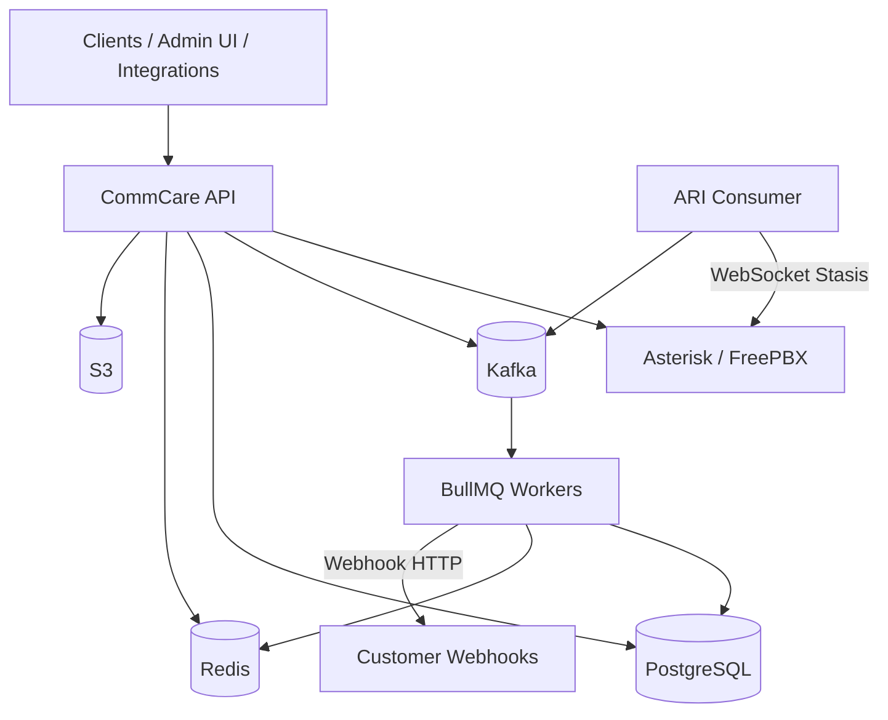

# CommCare

CommCare is a multi-tenant backend that sits **above Asterisk / FreePBX**. It exposes authenticated REST APIs, call orchestration (click2call), extension management, outbound webhooks, and async event processing — while Asterisk handles SIP, media, and telephony primitives.

CommCare does not replace Asterisk. It orchestrates and integrates with it through **ARI**, **AMI/CDR**, and **FreePBX APIs**, storing application state in PostgreSQL and processing telephony events through **Kafka → BullMQ** workers.

## Architecture




| Layer            | Responsibility                                                                   |
| ---------------- | -------------------------------------------------------------------------------- |
| **CommCare API** | Auth, tenancy, extensions, click2call, webhook registry, CDR ingest              |
| **ARI Consumer** | Single leader WebSocket to Asterisk Stasis app (`pbx`), publishes ARI events     |
| **Workers**      | Kafka → BullMQ handlers: ARI call flow, webhook fanout/delivery, CDR, extensions |
| **Asterisk**     | SIP/PJSIP, channels, bridges, media                                              |
| **PostgreSQL**   | Calls, legs, events, tenants, users, extensions, webhooks                        |
| **Redis**        | Cache, distributed locks (ARI leader election), BullMQ                           |
| **Kafka**        | Durable event bus between producers and workers                                  |
| **S3**           | Recordings, attachments (presigned URLs)                                         |


## Tech stack

- [NestJS](https://nestjs.com) — application framework
- [TypeORM](https://typeorm.io) — PostgreSQL ORM (reader/writer)
- [Zod](https://zod.dev) — config and request validation
- [KafkaJS](https://kafka.js.org) + [BullMQ](https://docs.bullmq.io) — async events (Kafka → BullMQ → handlers)
- [Redis](https://redis.io) — locks, queues, extension pool cache
- [AWS S3](https://aws.amazon.com/s3/) — object storage
- [Prometheus](https://prometheus.io) + [Grafana](https://grafana.com) + [OpenTelemetry](https://opentelemetry.io) — metrics & tracing
- [Asterisk ARI](https://docs.asterisk.org/Configuration/Interfaces/Asterisk-REST-Interface-ARI/) — call control
- [FreePBX GraphQL](https://wiki.freepbx.org/) — extension provisioning


## Project structure

```
src/
├── config/                 # Validated environment (Zod)
├── constants/              # App & event constants
├── infra/
│   ├── bullmq/             # BullMQ producers, consumers, Bull Board UI
│   ├── database/           # PostgreSQL + TypeORM (reader/writer)
│   ├── kafka/              # Kafka producers & consumers
│   ├── observability/      # Prometheus, OpenTelemetry tracing
│   ├── queue/              # EventProducer, subscriber registry
│   ├── redis/              # Redis + Redlock
│   └── storage/            # S3 presigned URL API
├── modules/
│   ├── calls/              # Click2call, call/legs/events persistence
│   ├── healthCheck/        # Liveness, readiness, Asterisk ping
│   ├── iam/                # Auth, users, sessions, OTP, visitors
│   ├── pbx/                # Asterisk ARI, FreePBX, extensions, ARI consumer
│   ├── tenancy/            # Tenants & extension assignment
│   └── webhook/            # Webhook registry, fanout, delivery, logs
├── shared/                 # Guards, pipes, filters, request client
├── main.ts                 # API entrypoint
└── ari-consumer.main.ts    # Dedicated ARI WebSocket process
```


## Modules & services


### IAM (`/auth`, `/users`)

Identity and access for multi-tenant users.

- JWT access/refresh tokens, sessions, visitors
- OTP-based auth flows
- Auth event audit trail


### Tenancy (`/tenancy`, `/tenancy/extension`)

- Tenant CRUD and configuration
- Bulk extension assignment to tenants/users
- Extension pool maintenance jobs


### PBX (`/pbx`, FreePBX integration)

Low-level telephony integration (not the primary app API for calls).


| Service              | Role                                                                               |
| -------------------- | ---------------------------------------------------------------------------------- |
| `AsteriskService`    | ARI REST: originate, bridge, hangup, health ping                                   |
| `AriConsumerService` | WebSocket to Stasis app `pbx`, leader election via Redis, publishes `ariCallEvent` |
| `ExtensionService`   | Extension pool, FreePBX create, tenant assignment                                  |
| `FreePbxService`     | FreePBX GraphQL API client                                                         |
| `AsteriskCDRService` | CDR event worker (Kafka `cdrEvent`)                                                |


**Docker:** `commcare-ari-consumer` runs the ARI WebSocket; the API sets `ARI_CONSUMER_ENABLED=false`.

### Calls (`/calls`)

Application-level call control and click2call workflow.


| Endpoint                     | Description                                                     |
| ---------------------------- | --------------------------------------------------------------- |
| `POST /calls/click-to-call`  | Authenticated click2call (agent → callee, internal or external) |
| `POST /calls/cdr/webhook`    | Asterisk CDR batch ingest → Kafka `cdrEvent`                    |
| `POST /calls/dialer/session` | Dialer session start/end (stub)                                 |


**Data model:** `calls`, `call_legs`, `call_events`

**Click2call flow:**

```text
API originate agent leg → ARI Stasis → Kafka ariCallEvent → CallsService
  → agent answers → originate callee → bridge → connected
  → hangup / no-answer → disposition + webhooks
```

**Call statuses:** `initiated`, `originating`, `ringing`, `answered`, `completed`, `no_answer`, `busy`, `failed`, `cancelled`, `rejected`

**Disposition logic:** `src/modules/calls/utils/ari-hangup.util.ts` maps ARI hangup causes and leg answer state to call/leg status.

### Webhooks (`/webhook-registry`, `/webhook-logs`)

Tenant-configurable HTTP callbacks for telephony events.

**Click2call trigger events:**


| Trigger                         | When                             |
| ------------------------------- | -------------------------------- |
| `Click2Call.CallerConnected`    | Agent leg answered               |
| `Click2Call.CallerNoAnswer`     | Agent never answered             |
| `Click2Call.CallerDisconnected` | Agent leg ended (non–no-answer)  |
| `Click2Call.CalleeConnected`    | Both legs bridged                |
| `Click2Call.CalleeNoAnswer`     | Callee never answered            |
| `Click2Call.CalleeDisconnected` | Callee leg ended (non–no-answer) |


**Pipeline:** lifecycle event → Kafka `webhookFanout` → `WebhookDispatcherService` → per-registry Kafka `webhookDelivery` → HTTP POST + `webhook_logs`.

### Health check (`/healthCheck`)


| Endpoint                  | Purpose                                |
| ------------------------- | -------------------------------------- |
| `GET /healthCheck/health` | Overall status with dependency details |
| `GET /healthCheck/livez`  | Liveness                               |
| `GET /healthCheck/readyz` | Readiness (DB)                         |


### Storage

S3-backed presigned URL API for uploads, downloads, deletes, and existence checks.

## Event pipeline

All async handlers are registered in `src/infra/queue/subscriber-config.ts`.


| Kafka event                | Handler                    | Purpose                                  |
| -------------------------- | -------------------------- | ---------------------------------------- |
| `ariCallEvent`             | `CallsService`             | Click2call Stasis/state/destroy handling |
| `webhookFanout`            | `WebhookDispatcherService` | Resolve registries, enqueue deliveries   |
| `webhookDelivery`          | `WebhookDispatcherService` | HTTP delivery + logging                  |
| `cdrEvent`                 | `AsteriskCDRService`       | Post-call CDR processing                 |
| `extensionCreate`          | `ExtensionService`         | Extension provisioning jobs              |
| `bulkExtensionAssignment`  | `TenancyExtensionService`  | Tenant extension bulk assign             |
| `extensionPoolMaintenance` | `ExtensionService`         | Pool top-up                              |
| `healthCheckPerformed`     | `HealthCheckService`       | Async health checks                      |


**Enable workers** on the process that should consume jobs:

```env
KAFKA_SUBSCRIBER=ALL
BULLMQ_SUBSCRIBER=ALL
BULLMQ_CONSUMERS_ENABLED=true
```

Docker `commcare-app` sets these automatically. Local dev often uses `NONE` until you need async processing.

## Getting started


### Prerequisites

- Node.js 20+
- pnpm
- Docker & Docker Compose
- Asterisk with ARI enabled (Stasis app: `pbx`) and/or FreePBX


### Install

```bash
pnpm install
```


### Environment

```bash
cp env-sample .env
```

Key variables:


| Variable                                 | Description                                                 |
| ---------------------------------------- | ----------------------------------------------------------- |
| `HTTP_PORT`                              | API port (default `3000`)                                   |
| `WRITER_DB_*` / `READER_DB_*`            | PostgreSQL connections                                      |
| `REDIS_HOST`                             | Redis for BullMQ + ARI leader lock                          |
| `KAFKA_BROKERS`                          | Kafka bootstrap servers                                     |
| `KAFKA_SUBSCRIBER` / `BULLMQ_SUBSCRIBER` | `ALL` to run event workers                                  |
| `ARI_HOST`, `ARI_USER`, `ARI_PASSWORD`   | Asterisk ARI REST                                           |
| `ARI_CONSUMER_ENABLED`                   | `true` only for in-process ARI consumer (local dev)         |
| `ARI_OUTBOUND_ENDPOINT_TEMPLATE`         | External dial template, e.g. `Local/{number}@from-internal` |
| `FREEPBX_*`                              | FreePBX OAuth + GraphQL for extension sync                  |
| `JWT_SECRET`                             | Auth signing secret (min 32 chars)                          |
| `WEBHOOK_URL`                            | CDR worker target (`http://host:3000/calls/cdr/webhook`)    |


Environment is validated at startup via `src/config/env.config.ts`.

### Docker — infrastructure

```bash
docker compose -f docker/docker-compose.infra.yaml up -d
```

Host `.env` when running API locally:


| Variable                            | Value            |
| ----------------------------------- | ---------------- |
| `WRITER_DB_HOST` / `READER_DB_HOST` | `localhost`      |
| `REDIS_HOST`                        | `localhost`      |
| `KAFKA_BROKERS`                     | `localhost:9094` |


### Docker — application

```bash
docker compose -f docker/docker-compose.yaml up -d --build
```


| Service                        | Role                            |
| ------------------------------ | ------------------------------- |
| `commcare-app`                 | REST API + Kafka/BullMQ workers |
| `commcare-ari-consumer`        | ARI WebSocket → Kafka           |
| `commcare-asterisk-cdr-worker` | AMI listener → CDR webhook      |


| URL                                                                      | Service                 |
| ------------------------------------------------------------------------ | ----------------------- |
| [http://localhost:3000](http://localhost:3000)                           | CommCare API            |
| [http://localhost:3000/metrics](http://localhost:3000/metrics)           | Prometheus metrics      |
| [http://localhost:3000/admin/queues](http://localhost:3000/admin/queues) | Bull Board (if enabled) |


### Local development

```bash
# API + workers (set KAFKA_SUBSCRIBER/BULLMQ_SUBSCRIBER=ALL in .env for click2call events)
pnpm run start:dev

# Dedicated ARI consumer (separate terminal)
pnpm run start:ari-consumer:dev
```


## Scripts


| Command                           | Description                 |
| --------------------------------- | --------------------------- |
| `pnpm run start:dev`              | API with hot reload         |
| `pnpm run start:ari-consumer:dev` | ARI WebSocket consumer only |
| `pnpm run build`                  | Compile TypeScript          |
| `pnpm run test`                   | Unit tests                  |
| `pnpm run test:e2e`               | End-to-end tests            |
| `pnpm run lint`                   | ESLint                      |


## Related docs

- `[src/infra/database/README.md](./src/infra/database/README.md)` — database setup notes


## License

UNLICENSED — private project.