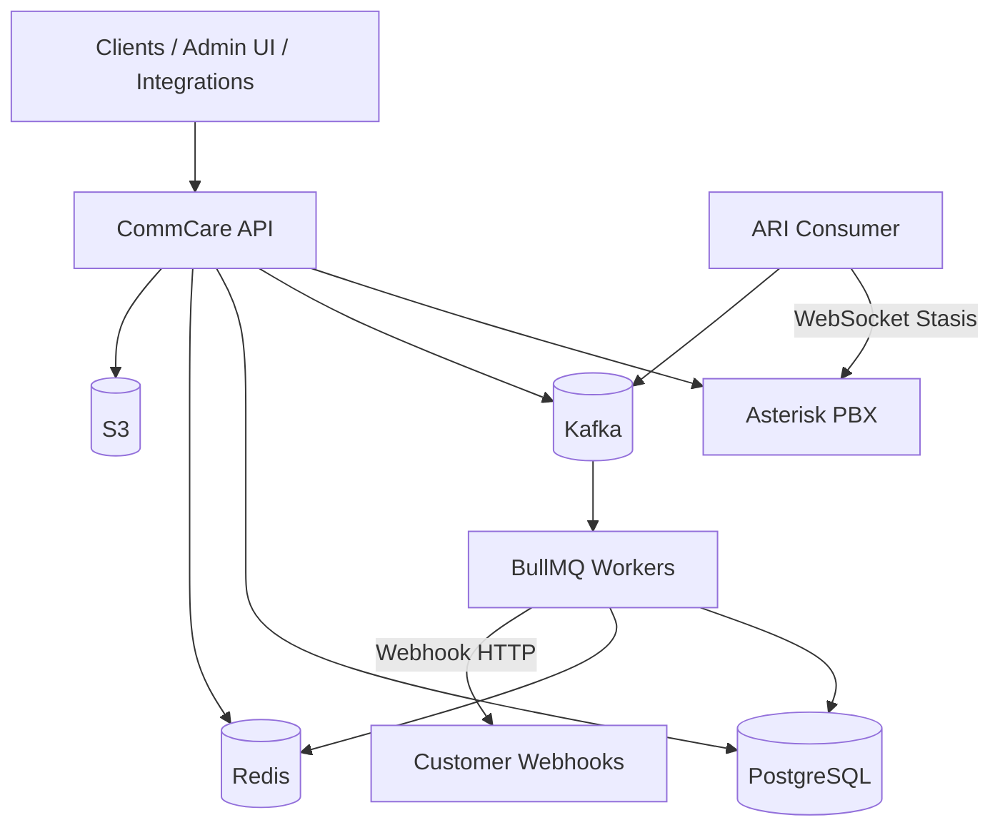

# CommCare

CommCare is a multi-tenant backend that sits **above Asterisk**. It exposes authenticated REST APIs, call orchestration (click2call, IVR, inbound routing), extension management, outbound webhooks, and async event processing — while Asterisk handles SIP, media, and telephony primitives.

CommCare does not replace Asterisk. It orchestrates and integrates with it through **ARI** and **AMI/CDR**, provisioning PJSIP extensions via **PostgreSQL realtime** (`ps_*` tables — no `pjsip reload` per extension). Application state lives in PostgreSQL; telephony events flow through **Kafka → BullMQ** workers.

## Architecture




| Layer            | Responsibility                                                                   |
| ---------------- | -------------------------------------------------------------------------------- |
| **CommCare API** | Auth, tenancy, extensions, click2call, webhook registry, CDR ingest              |
| **ARI Consumer** | Single leader WebSocket to Asterisk Stasis app (`pbx`), publishes ARI events     |
| **Workers**      | Kafka → BullMQ handlers: ARI call flow, webhook fanout/delivery, CDR, extensions |
| **Asterisk**     | SIP/PJSIP, channels, bridges, media                                              |
| **PostgreSQL**   | Calls, legs, events, tenants, users, extensions, webhooks                        |
| **Redis**        | Cache, distributed locks (ARI leader election), BullMQ                           |
| **Kafka**        | Durable event bus between producers and workers                                  |
| **S3**           | Recordings, attachments (presigned URLs)                                         |


## Tech stack

- [NestJS](https://nestjs.com) — application framework
- [TypeORM](https://typeorm.io) — PostgreSQL ORM (reader/writer)
- [Zod](https://zod.dev) — config and request validation
- [KafkaJS](https://kafka.js.org) + [BullMQ](https://docs.bullmq.io) — async events (Kafka → BullMQ → handlers)
- [Redis](https://redis.io) — locks, queues, extension pool cache
- [AWS S3](https://aws.amazon.com/s3/) — object storage
- [Prometheus](https://prometheus.io) + [Grafana](https://grafana.com) + [OpenTelemetry](https://opentelemetry.io) — metrics & tracing
- [Asterisk ARI](https://docs.asterisk.org/Configuration/Interfaces/Asterisk-REST-Interface-ARI/) — call control
- [Asterisk PJSIP Realtime](https://docs.asterisk.org/Configuration/Channel-Drivers/SIP/Configuring-res_pjsip/PJSIP-Configuration-Wizard-and-Realtime/) — extension provisioning via PostgreSQL


## Project structure

```
src/
├── config/                 # Validated environment (Zod)
├── constants/              # App & event constants
├── infra/
│   ├── bullmq/             # BullMQ producers, consumers, Bull Board UI
│   ├── database/           # PostgreSQL + TypeORM (reader/writer)
│   ├── kafka/              # Kafka producers & consumers
│   ├── observability/      # Prometheus, OpenTelemetry tracing
│   ├── queue/              # EventProducer, subscriber registry
│   ├── redis/              # Redis + Redlock
│   └── storage/            # S3 presigned URL API
├── modules/
│   ├── calls/              # Click2call, call/legs/events persistence
│   ├── healthCheck/        # Liveness, readiness, Asterisk ping
│   ├── iam/                # Auth, users, sessions, OTP, visitors
│   ├── pbx/                # Asterisk ARI, PJSIP realtime provisioning, extensions, ARI consumer
│   ├── trunk/              # SIP trunk CRUD + Asterisk identify/endpoint sync
│   ├── tenancy/            # Tenants & extension assignment
│   └── webhook/            # Webhook registry, fanout, delivery, logs
├── shared/                 # Guards, pipes, filters, request client
├── main.ts                 # API entrypoint
└── ari-consumer.main.ts    # Dedicated ARI WebSocket process
```


## Modules & services


### IAM (`/auth`, `/users`)

Identity and access for multi-tenant users.

- JWT access/refresh tokens, sessions, visitors
- OTP-based auth flows
- Auth event audit trail


### Tenancy (`/tenancy`, `/tenancy/extension`)

- Tenant CRUD and configuration
- Bulk extension assignment to tenants/users
- Extension pool maintenance jobs


### PBX (`/pbx`)

Low-level telephony integration (not the primary app API for calls).

**Stasis appArgs convention:** `[workflow, tenantId, correlationId, ...]` — e.g. `click2call`, `ivr`, `inbound-route`.

| Service                       | Role                                                                               |
| ----------------------------- | ---------------------------------------------------------------------------------- |
| `AsteriskService`             | ARI REST: originate, bridge, hangup, playback, health ping                         |
| `AriConsumerService`          | WebSocket to Stasis app `pbx`, leader election via Redis, publishes `ariCallEvent` |
| `AsteriskProvisioningService` | Upsert/delete `ps_*` realtime rows (extensions + SIP trunks, no reload)            |
| `ExtensionService`            | Extension pool, Asterisk provisioning, tenant assignment                           |
| `CallWorkflowRouterService`   | Routes ARI events to workflow handlers (click2call, IVR, inbound)                  |
| `AsteriskCDRService`          | CDR event worker (Kafka `cdrEvent`)                                                |


**Docker:** `commcare-ari-consumer` runs the ARI WebSocket; the API sets `ARI_CONSUMER_ENABLED=false`.

### SIP trunks (`/pbx/trunks`)

Carrier inbound trunks (e.g. Plivo Zentrunk) are stored in CommCare (`sip_trunks`, `sip_trunk_identify_ips`) and synced to Asterisk PJSIP realtime (`ps_endpoints`, `ps_endpoint_id_ips`). Trunk endpoints use dialplan context `from-trunk`, which enters Stasis `inbound-route` with DID=`${EXTEN}`.

| Endpoint | Description |
| -------- | ----------- |
| `POST /pbx/trunks` | Create trunk (`authMode`: `ip` or `credentials`) |
| `GET /pbx/trunks/tenant` | List trunks for tenant |
| `GET /pbx/trunks/:id` | Get trunk |
| `PATCH /pbx/trunks/:id` | Update trunk |
| `DELETE /pbx/trunks/:id` | Delete trunk + Asterisk rows |
| `POST /pbx/trunks/:id/sync-asterisk` | Re-provision Asterisk realtime rows |

#### Plivo inbound (IP auth) checklist

1. Apply Asterisk SQL: `docker/postgres/003_ps_endpoint_id_ips.sql` (and restart Asterisk after `sorcery.conf` / `extconfig.conf` / `extensions.conf` updates).
2. In Plivo, set inbound trunk Primary URI to `sip:YOUR_PUBLIC_IP:5060` and assign the DID.
3. Create a CommCare trunk with `authMode: "ip"` and `identifyIps` including Plivo signaling IPs (from failed-INVITE logs / Plivo docs), e.g. `13.52.9.100`.
4. Create an inbound route with `sourceType: phone_number` and `sourceValue` **exactly** equal to Asterisk `${EXTEN}` for that DID (including `+` / country code if Plivo sends it that way).
5. Allow UDP/TCP 5060 and RTP from Plivo at the firewall.
6. Place a test call; Asterisk must not log `No matching endpoint found` for the Plivo INVITE, and inbound-route Stasis should run.

Prefer **IP auth** for providers like Plivo Zentrunk that identify peers by signaling IP and put the DID in the SIP `From` user (not a trunk username).

#### Credentials (username/password) trunk checklist

Use `authMode: "credentials"` when the carrier authenticates to Asterisk with SIP digest (username/password).

1. Create a trunk with `authMode: "credentials"`, `username`, and `password` (username ≤ 40 chars; must not collide with extension numbers or other endpoint ids).
2. CommCare provisions Asterisk with **PJSIP endpoint id = SIP username** and a linked `ps_auths` row so Asterisk can match the peer by username, challenge, and verify the password.
3. `identifyIps` is **optional** for credentials mode (defense-in-depth). Add them if the provider also has stable signaling IPs; leave empty when matching is username-only.
4. Configure the carrier to identify as that username on inbound INVITEs (digest username). If the provider only ever sends a DID in `From` and never the trunk username, use IP auth instead (or combine identify IPs + credentials).
5. Create an inbound route whose `sourceValue` matches Asterisk `${EXTEN}` for the DID.
6. After create/update, confirm with `asterisk -rx "pjsip show endpoint <username>"` that the endpoint shows `InAuth` and `context: from-trunk`.
7. Place a test call; a wrong password must fail authentication and must not enter inbound-route Stasis. If an existing credentials trunk still has a legacy `trunk-{uuid}` endpoint id, call `POST /pbx/trunks/:id/sync-asterisk` once to rewrite it to the username.

Application-level call control and click2call workflow.


| Endpoint                     | Description                                                     |
| ---------------------------- | --------------------------------------------------------------- |
| `POST /calls/click-to-call`  | Authenticated click2call (agent → callee, internal or external) |
| `POST /calls/cdr/webhook`    | Asterisk CDR batch ingest → Kafka `cdrEvent`                    |
| `POST /calls/dialer/session` | Dialer session start/end (stub)                                 |


**Data model:** `calls`, `call_legs`, `call_events`

**Click2call flow:**

```text
API originate agent leg → ARI Stasis → Kafka ariCallEvent → CallsService
  → agent answers → originate callee → bridge → connected
  → hangup / no-answer → disposition + webhooks
```

**Call statuses:** `initiated`, `originating`, `ringing`, `answered`, `completed`, `no_answer`, `busy`, `failed`, `cancelled`, `rejected`

**Disposition logic:** `src/modules/calls/utils/ari-hangup.util.ts` maps ARI hangup causes and leg answer state to call/leg status.

### Webhooks (`/webhook-registry`, `/webhook-logs`)

Tenant-configurable HTTP callbacks for telephony events.

**Click2call trigger events:**


| Trigger                         | When                             |
| ------------------------------- | -------------------------------- |
| `Click2Call.CallerConnected`    | Agent leg answered               |
| `Click2Call.CallerNoAnswer`     | Agent never answered             |
| `Click2Call.CallerDisconnected` | Agent leg ended (non–no-answer)  |
| `Click2Call.CalleeConnected`    | Both legs bridged                |
| `Click2Call.CalleeNoAnswer`     | Callee never answered            |
| `Click2Call.CalleeDisconnected` | Callee leg ended (non–no-answer) |


**Pipeline:** lifecycle event → Kafka `webhookFanout` → `WebhookDispatcherService` → per-registry Kafka `webhookDelivery` → HTTP POST + `webhook_logs`.

### Health check (`/healthCheck`)


| Endpoint                  | Purpose                                |
| ------------------------- | -------------------------------------- |
| `GET /healthCheck/health` | Overall status with dependency details |
| `GET /healthCheck/livez`  | Liveness                               |
| `GET /healthCheck/readyz` | Readiness (DB)                         |


### Storage

S3-backed presigned URL API for uploads, downloads, deletes, and existence checks.

## Event pipeline

All async handlers are registered in `src/infra/queue/subscriber-config.ts`.


| Kafka event                | Handler                    | Purpose                                  |
| -------------------------- | -------------------------- | ---------------------------------------- |
| `ariCallEvent`             | `CallsService`             | Click2call Stasis/state/destroy handling |
| `webhookFanout`            | `WebhookDispatcherService` | Resolve registries, enqueue deliveries   |
| `webhookDelivery`          | `WebhookDispatcherService` | HTTP delivery + logging                  |
| `cdrEvent`                 | `AsteriskCDRService`       | Post-call CDR processing                 |
| `extensionCreate`          | `ExtensionService`         | Extension provisioning jobs              |
| `bulkExtensionAssignment`  | `TenancyExtensionService`  | Tenant extension bulk assign             |
| `extensionPoolMaintenance` | `ExtensionService`         | Pool top-up                              |
| `healthCheckPerformed`     | `HealthCheckService`       | Async health checks                      |


**Enable workers** on the process that should consume jobs:

```env
KAFKA_SUBSCRIBER=ALL
BULLMQ_SUBSCRIBER=ALL
BULLMQ_CONSUMERS_ENABLED=true
```

Docker `commcare-app` sets these automatically. Local dev often uses `NONE` until you need async processing.

## Getting started


### Prerequisites

- Node.js 20+
- pnpm
- Docker & Docker Compose
- Asterisk with ARI enabled (Stasis app: `pbx`) and PJSIP realtime connected to PostgreSQL


### Install

```bash
pnpm install
```


### Environment

```bash
cp env-sample .env
```

Key variables:


| Variable                                 | Description                                                 |
| ---------------------------------------- | ----------------------------------------------------------- |
| `HTTP_PORT`                              | API port (default `3000`)                                   |
| `WRITER_DB_*` / `READER_DB_*`            | PostgreSQL connections                                      |
| `REDIS_HOST`                             | Redis for BullMQ + ARI leader lock                          |
| `KAFKA_BROKERS`                          | Kafka bootstrap servers                                     |
| `KAFKA_SUBSCRIBER` / `BULLMQ_SUBSCRIBER` | `ALL` to run event workers                                  |
| `ARI_HOST`, `ARI_USER`, `ARI_PASSWORD`   | Asterisk ARI REST                                           |
| `ARI_CONSUMER_ENABLED`                   | `true` only for in-process ARI consumer (local dev)         |
| `ARI_OUTBOUND_ENDPOINT_TEMPLATE`         | External dial template, e.g. `Local/{number}@from-internal` |
| `JWT_SECRET`                             | Auth signing secret (min 32 chars)                          |
| `WEBHOOK_URL`                            | CDR worker target (`http://host:3000/calls/cdr/webhook`)    |


Environment is validated at startup via `src/config/env.config.ts`.

### Docker — infrastructure

```bash
cp docker/asterisk/.env.sample docker/asterisk/.env
docker compose -f docker/docker-compose.infra.yaml up -d
```

**Two env files in dev:**

| File | Purpose |
| ---- | ------- |
| `.env` (project root) | CommCare app: `ARI_USER`, `ARI_PASSWORD`, DB, Kafka, etc. |
| `docker/asterisk/.env` | Asterisk container: `ASTERISK_ARI_*`, `ASTERISK_AMI_*`, DB DSN, dev SIP passwords |

Keep ARI/AMI credentials in sync between both files. Mismatched values cause ARI authentication failures.

| Asterisk env (`docker/asterisk/.env`) | CommCare env (`.env`) |
| ------------------------------------- | --------------------- |
| `ASTERISK_ARI_USER` | `ARI_USER` |
| `ASTERISK_ARI_PASSWORD` | `ARI_PASSWORD` |
| `ASTERISK_AMI_USERNAME` | `AMI_USERNAME` |
| `ASTERISK_AMI_SECRET` | `AMI_SECRET` |
| `ASTERISK_DEV_EXT_101_PASSWORD` | (softphone 101 secret) |
| `ASTERISK_DEV_EXT_102_PASSWORD` | (softphone 102 secret) |

Host `.env` when running API locally:


| Variable                            | Value            |
| ----------------------------------- | ---------------- |
| `WRITER_DB_HOST` / `READER_DB_HOST` | `localhost`      |
| `REDIS_HOST`                        | `localhost`      |
| `KAFKA_BROKERS`                     | `localhost:9094` |


### Docker — application

```bash
docker compose -f docker/docker-compose.yaml up -d --build
```


| Service                        | Role                            |
| ------------------------------ | ------------------------------- |
| `commcare-app`                 | REST API + Kafka/BullMQ workers |
| `commcare-ari-consumer`        | ARI WebSocket → Kafka           |
| `commcare-asterisk-cdr-worker` | AMI listener → CDR webhook      |


| URL                                                                      | Service                 |
| ------------------------------------------------------------------------ | ----------------------- |
| [http://localhost:3000](http://localhost:3000)                           | CommCare API            |
| [http://localhost:3000/metrics](http://localhost:3000/metrics)           | Prometheus metrics      |
| [http://localhost:3000/admin/queues](http://localhost:3000/admin/queues) | Bull Board (if enabled) |


### Local development

```bash
# API + workers (set KAFKA_SUBSCRIBER/BULLMQ_SUBSCRIBER=ALL in .env for click2call events)
pnpm run start:dev

# Dedicated ARI consumer (separate terminal)
pnpm run start:ari-consumer:dev
```


## Scripts


| Command                           | Description                 |
| --------------------------------- | --------------------------- |
| `pnpm run start:dev`              | API with hot reload         |
| `pnpm run start:ari-consumer:dev` | ARI WebSocket consumer only |
| `pnpm run build`                  | Compile TypeScript          |
| `pnpm run test`                   | Unit tests                  |
| `pnpm run test:e2e`               | End-to-end tests            |
| `pnpm run lint`                   | ESLint                      |


## Related docs

- `[src/infra/database/README.md](./src/infra/database/README.md)` — database setup notes


## License

UNLICENSED — private project.