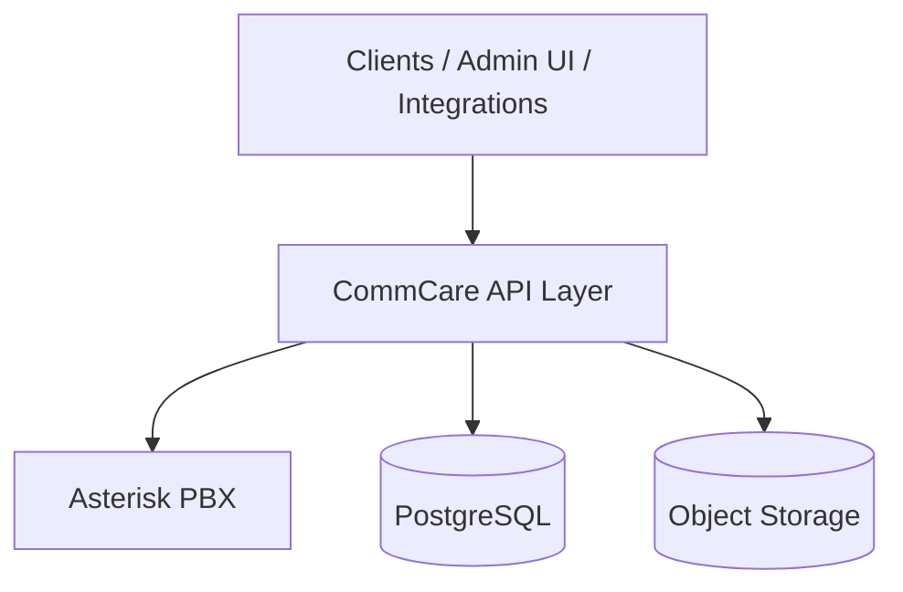

# CommCare

CommCare is a backend service layer that sits **above Asterisk**. It exposes APIs and business logic for multi-tenant communication workflows while Asterisk handles the core telephony stack (SIP, media, dialplan, and call routing).

CommCare does not replace Asterisk. It orchestrates, extends, and integrates with it — providing tenancy, storage, health monitoring, and higher-level PBX services that applications and operators can consume without talking to Asterisk directly.

## Architecture



| Layer | Responsibility |
|-------|----------------|
| **CommCare** | REST APIs, tenancy, call orchestration, file storage, health checks |
| **Asterisk** | SIP trunks, extensions, IVR, queues, media, dialplan execution |
| **PostgreSQL** | Application data with reader/writer connections |
| **S3** | Recordings, attachments, and other object storage |

## Tech stack

- [NestJS](https://nestjs.com) — application framework
- [TypeORM](https://typeorm.io) — PostgreSQL ORM (reader/writer)
- [Zod](https://zod.dev) — environment validation
- [AWS S3](https://aws.amazon.com/s3/) — object storage (presigned URLs)
- [Prometheus](https://prometheus.io) + [Grafana](https://grafana.com) + [Loki](https://grafana.com/oss/loki/) — metrics & logs
- [Asterisk](https://www.asterisk.org/) — underlying PBX (external)

## Project structure

```
src/
├── config/              # Validated environment config
├── constants/           # App-level constants
├── infra/
│   ├── database/        # PostgreSQL + TypeORM (reader/writer)
│   ├── observability/   # Prometheus metrics (/metrics)
│   └── storage/         # S3 storage abstraction
├── modules/
│   ├── healthCheck/     # Liveness & readiness probes
│   ├── pbx/             # PBX orchestration + Asterisk integration
│   └── tenancy/         # Multi-tenant management
└── shared/              # Pipes, response helpers
```

## Modules

### PBX
Wraps Asterisk operations and exposes higher-level PBX APIs. The `AsteriskService` is the integration point with the Asterisk server (AMI, ARI, or other interfaces as implemented).

### Tenancy
Manages tenants in a multi-tenant deployment. Each tenant can map to isolated PBX configuration, users, and resources on Asterisk.

### Health check
Kubernetes-friendly endpoints:

| Endpoint | Purpose |
|----------|---------|
| `GET /healthCheck/health` | Overall status with dependency details |
| `GET /healthCheck/livez` | Liveness — process is running |
| `GET /healthCheck/readyz` | Readiness — DB connections are healthy |

### Storage
S3-backed presigned URL API for uploads, downloads, deletes, and existence checks (e.g. call recordings, voicemails, documents).

### Observability
- **`GET /metrics`** — Prometheus metrics (HTTP latency, request counts, Node.js runtime)
- **Prometheus** — scrapes app, node-exporter, postgres-exporter
- **Grafana** — dashboards (Prometheus + Loki datasources pre-provisioned)
- **Loki + Promtail** — container log aggregation (sidecar pattern)

## Getting started

### Prerequisites

- Node.js 20+
- pnpm
- Docker & Docker Compose
- Asterisk server (separate deployment)

### Install

```bash
pnpm install
```

### Environment

Copy the sample env file and adjust values:

```bash
cp env-sample .env
```

Key variables:

| Variable | Description |
|----------|-------------|
| `HTTP_PORT` | API server port (default `3000`) |
| `ENV` | `development` \| `production` \| `test` |
| `WRITER_DB_*` | Primary PostgreSQL connection |
| `READER_DB_*` | Read replica PostgreSQL connection |
| `AWS_*` | S3 credentials and bucket for storage |
| `METRICS_*` | Prometheus `/metrics` endpoint config |
| `SERVICE_NAME` | Service name for observability labels |

Environment is validated at startup via `src/config/env.config.ts`. The app exits with clear errors if required values are missing.

### Docker — infrastructure only (local dev)

Run PostgreSQL, Redis, and Kafka while developing on the host:

```bash
docker compose -f docker/docker-compose.infra.yaml up -d
```

Use these in your `.env`:

| Variable | Value |
|----------|-------|
| `WRITER_DB_HOST` / `READER_DB_HOST` | `localhost` |
| `REDIS_HOST` | `localhost` |
| `KAFKA_BROKERS` | `localhost:9092` |

### Docker (full stack)

Run CommCare with PostgreSQL, Redis, Kafka, and the observability stack:

```bash
docker compose -f docker/docker-compose.yaml up -d --build
```

| Service | URL |
|---------|-----|
| CommCare API | http://localhost:3000 |
| Metrics | http://localhost:3000/metrics |
| Prometheus | http://localhost:9090 |
| Grafana | http://localhost:3001 (admin / admin) |
| Loki | http://localhost:3100 |
| Redis | localhost:6379 |
| Kafka | localhost:9092 |

**Grafana dashboards to import:** Node Exporter Full (`1860`), PostgreSQL Database (`9628`).

Logs in Grafana → Explore → Loki: `{service="app"}`

### Run

```bash
# development (watch mode)
pnpm run start:dev

# production build
pnpm run build
pnpm run start:prod
```

API listens on `http://localhost:3000` (or your configured `HTTP_PORT`).

## Scripts

| Command | Description |
|---------|-------------|
| `pnpm run start:dev` | Start with hot reload |
| `pnpm run build` | Compile TypeScript |
| `pnpm run lint` | ESLint |
| `pnpm run test` | Unit tests |
| `pnpm run test:e2e` | End-to-end tests |

## License

UNLICENSED — private project.
